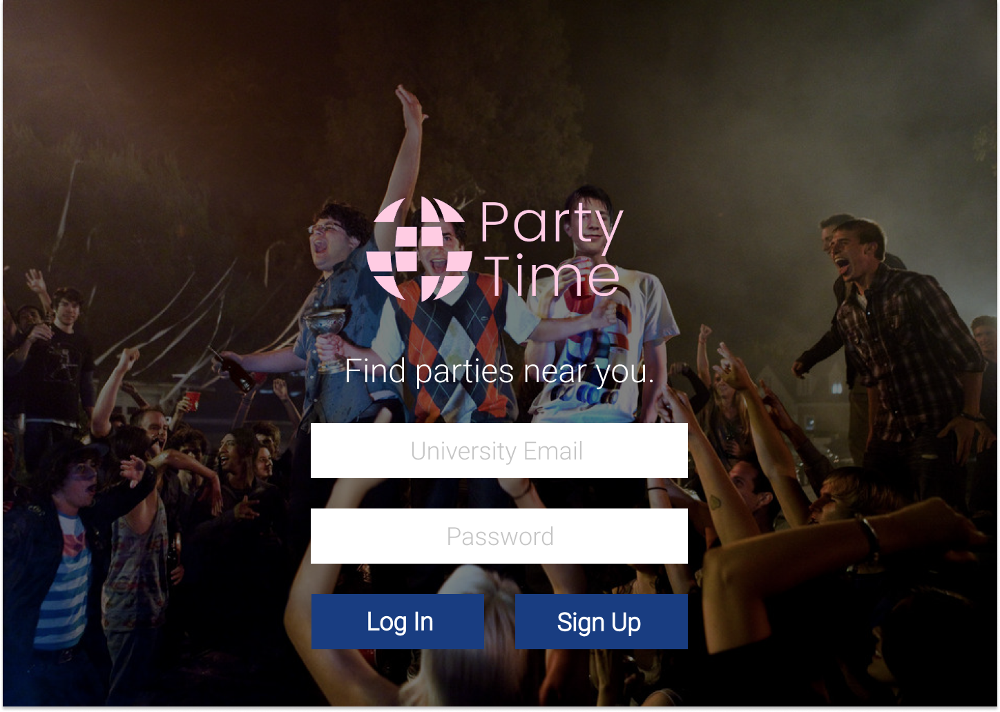
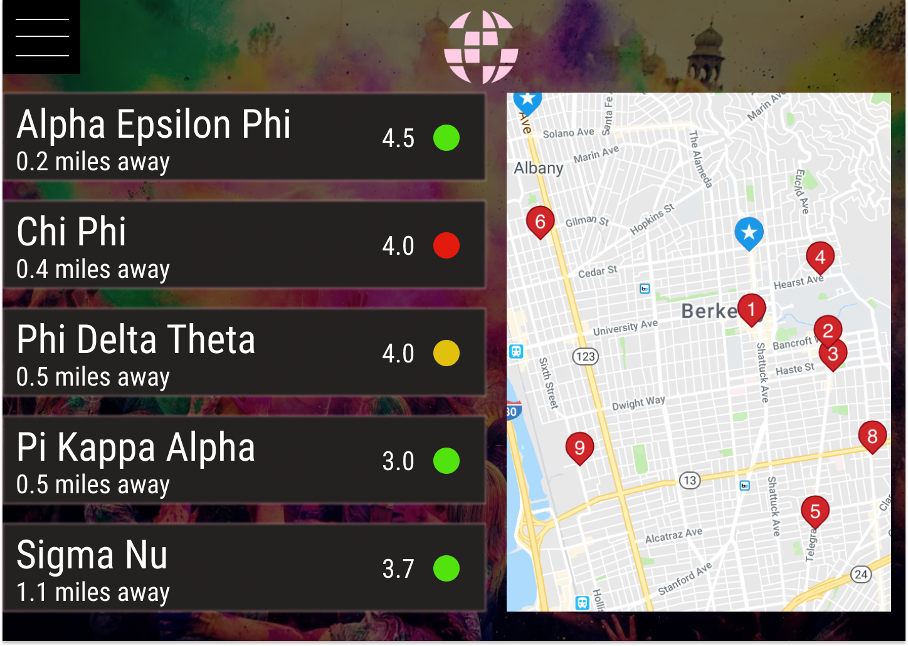
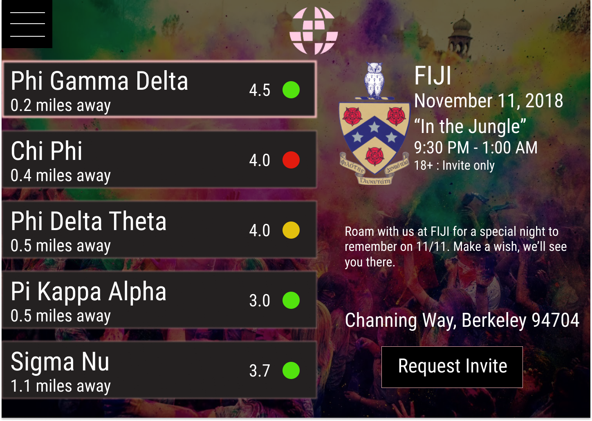

# PartyTime #

PartyTime is a web application concept that allows university students to find fraternity parties in their area in a safe and accessible way.  

## Motivation ##

Oftentimes, newer students are afraid of going out or have no connections to do so. This app will enable them 
to see what's out there on any given night. Ideally, this concept is most appropriate as a mobile app, since 
users will be able to see what other parties are open in real time in the event that one shuts down. This app would
also simplify the bidding and payment systems that fraternities often use to fundraise. Instead of paying at the door,
students can Venmo the fraternities beforehand right from the app. There are other improvements and ideas that can be made
for this app, but here's a fun concept that my friends and I made for CalHacks 5.0.

## Build Status ##

This project is mainly a design concept that we hope to implement into an actual social mobile app in the future. While the basic implementation of the application can be viewed in the mvp.zip file, the main functionality is demonstrated through our Figma file. 

## Screenshots ##

## Technology and frameworks used ##

**Built with**
  * Figma - the prototyping web application
  * HTML, CSS, and JavaScript - used for our MVP, contained in the mvp.zip file
  * Adobe Photoshop - used to design icons and logos for our concept

## Getting Started ##

There are three files in this repository. The best way to visualize our goal for this app is to download the Figma
web application and open the .fig file included in the repository. Once you open the app, select the entire project and
put it in prototype mode. Then, click present. You'll see the many ways that you can interact with this prototype by looking 
for icons highlighted in blue. 

## Credits ##

This is an original idea by Micah Yong, Sino Oulad Daoud, Aditya Ramkumar, and Almitra Dabholkar.
